# FormulaTelemetry — schémata

Dokumentace architektury a struktury. Stav kódu: Sync (Core / Console / Worker) + PostgreSQL + Web API + **Blazor WASM**. MAUI ještě není.

UI / UX návrh klientů (brand, light/dark, obrazovky): [ui-design.md](ui-design.md).

## Grafické diagramy

### Celková architektura

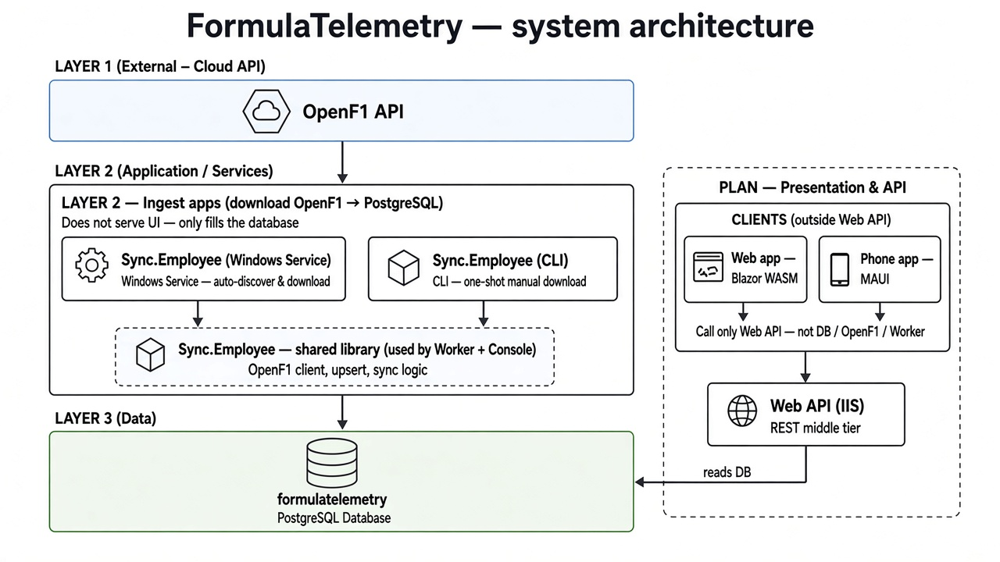

### Projekty řešení

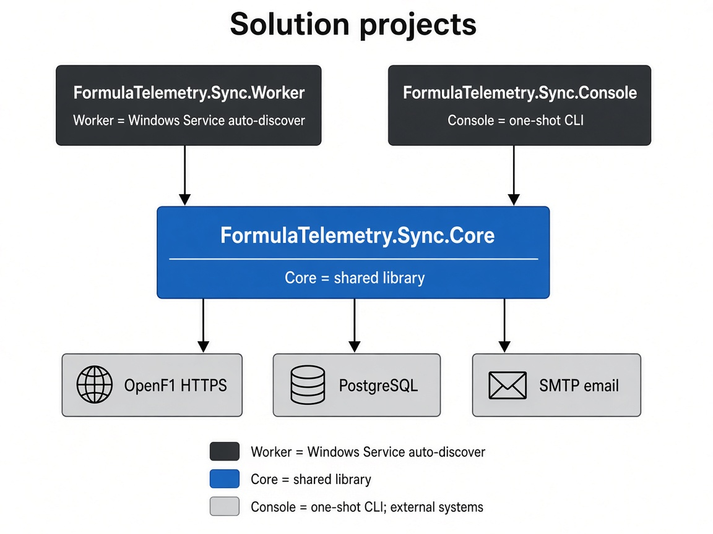

### Tok Worker (auto-discover)

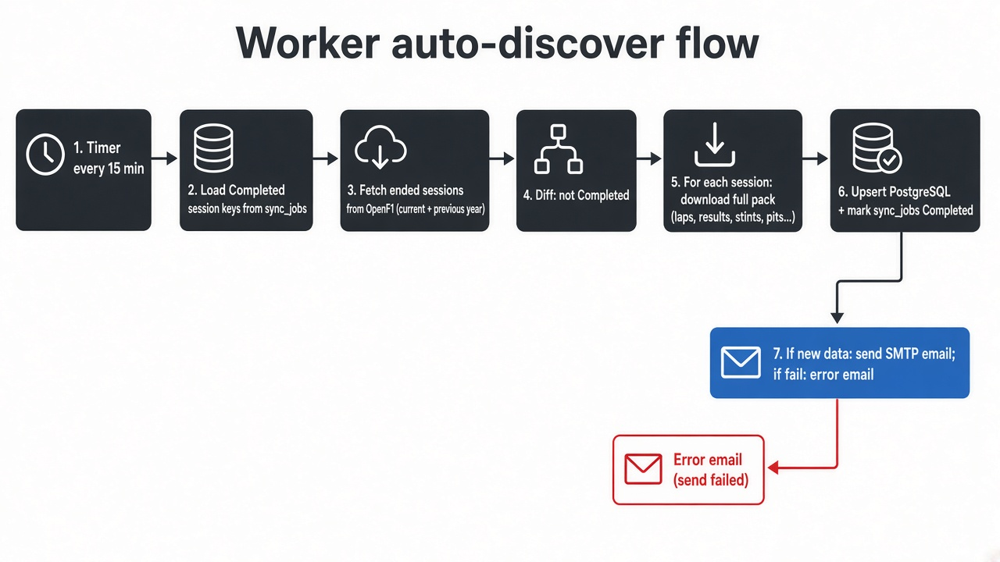

### Databázové schéma

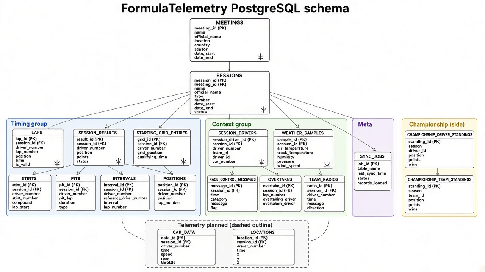

---

## Mermaid (editovatelné)

Níže jsou stejná schémata jako textový Mermaid (GitHub je vykreslí; lze upravit v PR).

## 1. Celková architektura (cílový stav)

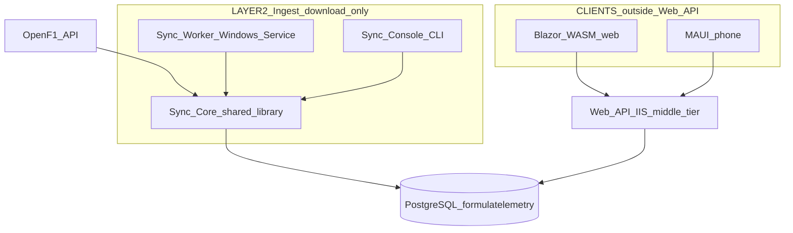

- **Layer 2** jen stahuje z OpenF1 do DB (neslouží UI).
- **Sync.Core** je sdílená knihovna — používá ji Worker i Console.
- **Klienti** (Blazor web + MAUI telefon) jsou **mimo / nad** Web API — volají jen API, ne DB / OpenF1 / Worker.
- **Web API** = jeden prostřední blok (IIS / REST) → PostgreSQL (zatím není).

## 2. Co je hotové vs. plán

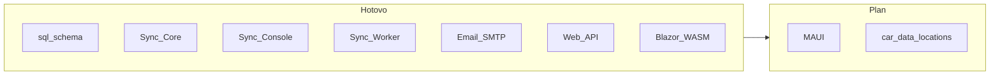

## 3. Projekty a závislosti

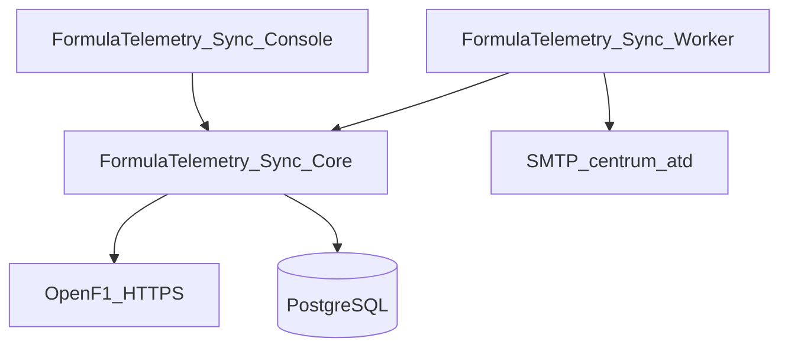

| Projekt | Typ | Úloha |
|---------|-----|--------|
| `Sync.Core` | knihovna | OpenF1 klient, upsert do PG, sync logika, SMTP notifier |
| `Sync.Console` | konzole | jednorázový sync (`--meeting`, `--discover`, …) |
| `Sync.Worker` | Worker / Windows služba | periodický auto-discover |

## 4. Tok dat — Worker auto-discover

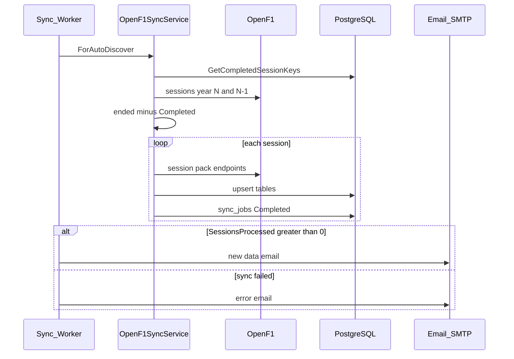

## 5. Vnitřní prvky Sync.Core

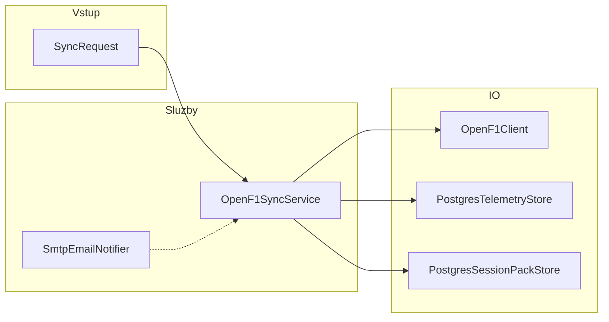

`SyncRequest` módy: `--session`, `--latest`, `--meeting`, `--year/--round`, `--year`, `--discover`, `--pending`.

## 6. Databázové schéma (ER)

Hierarchie a vazby (zjednodušené PK/FK). Telemetrie `car_data` / `locations` jsou ve schématu, sync je zatím **neplní**.

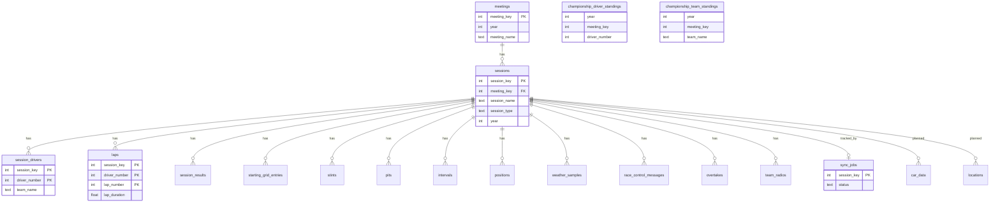

Šampionát (`championship_*`) se ukládá po **Race** session (viz DDL).

## 7. Tabulky podle oblasti

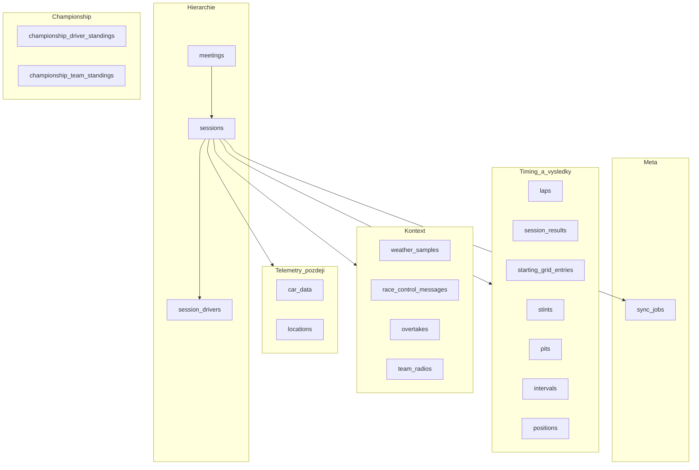

Detail sloupců a OpenF1 endpointů: [database.md](database.md). DDL: [`sql/001_openf1_schema.sql`](../sql/001_openf1_schema.sql).

## 8. Nasazení Sync.Worker

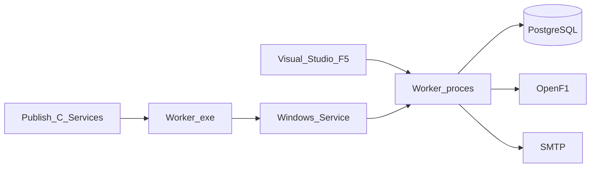

Služba: `FormulaTelemetry.Sync` → `C:\Services\FormulaTelemetry\FormulaTelemetry.Sync.Worker.exe`.
