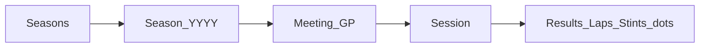

# FormulaTelemetry — UI design (web + mobil)

**Jediný zdroj pravdy pro vzhled a UX.** Implementaci Blazor webu (`FormulaTelemetry.Web`) děláte v kódu zvlášť — tento dokument je smlouva o designu, ne changelog kódu.

| Klient | Stack | Layout |
|--------|--------|--------|
| Web | Blazor WASM | Desktop-first — husté tabulky, split table+chart |
| Mobil | MAUI (později) | Phone-first — 1 graf, tabulka sekundárně |

Data: Web API → PostgreSQL. Sync (Worker/Console) do UI nepatří.

Související: [architecture.md](architecture.md), [database.md](database.md).

---

## 1. Vizuální směr — motorsport dashboard

Timing / engineering desk, ne obecný CRUD ani oficiální F1.com.

| Pravidlo | Detail |
|----------|--------|
| Dark-first | Asfalt `#121214` / surface `#18181B`, border `#27272A` (ne čistá černá) |
| Light | Volitelný toggle; stejné tokeny, jiné hodnoty |
| Karty | Season, Meeting, shell Resultsu = `ft-card`; **uvnitř** Resultsu dense table |
| Team stripe | 4px pruh podle `team_name` — hint, bez oficiálních log |
| Podium | P1–P3: zlato / stříbro / bronz (badge + lehký podkres řádku) |
| Časy | Monospace; Gap/Time z `gap_to_leader_json` / `duration_json` |
| Sektory (Laps) | Fialová = session best, zelená = personal best, jinak neutrál |
| Akcent appky | Amber `#E8A317` + cyan `#22D3EE` — **ne** F1 brand red `#e10600` jako identita |

---

## 2. Brand (bez Liberty / F1 IP)

| Položka | Hodnota |
|---------|---------|
| Produkt | `FormulaTelemetry` |
| UI jméno | **FT Telemetry** |
| Font UI | IBM Plex Sans (nebo Source Sans 3) |
| Font čísla | IBM Plex Mono (nebo JetBrains Mono) |
| Logo | stylizované „FT“ + waveform / sector tick |

**Zakázáno:** oficiální F1 logo/wordmark/fonty, startovní ramp jako app icon, team/Pirelli/FIA loga, kopie f1.com.

**Povoleno:** názvy GP, jména jezdců, text compound SOFT/MEDIUM/… jako data.

Orientační team hues (stripe/grafy): Ferrari červená, Mercedes tyrkys, McLaren oranžová, Red Bull modrá, Aston zelená, Alpine růžová, Williams světle modrá, Haas šedá, Sauber/Kick zelená, Racing Bulls modrá — vždy bez trademark artwork.

---

## 3. Informační architektura

**Flow:** sezóna → meeting → session → záložky views.

### Obrazovky

| ID | Obrazovka | Obsah |
|----|-----------|--------|
| `S-SEASON` | Season | Karty GP: round, název, země (+ později vlajka), datum, status `Completed` / `Next` / `Upcoming` |
| `S-MEETING` | Meeting | Seznam session jako řádky/karty |
| `S-SESSION` | Session hub | Breadcrumb + taby views |
| `V-RESULTS` | Results | Viz §5 |
| `V-LAPS` | Laps | Tabulka + line chart; sektory PB/SB barvy |
| `V-STINTS` | Stints/Pits | Timeline + compound badge |
| `V-GAPS` | Positions/Intervals | Race gaps |
| `V-WEATHER` / `V-RC` / `V-GRID` | Weather, Race control, Grid | v1.1 |
| `A-THEME` | Theme | Dark (default) / Light, persistence (např. `localStorage`) |

### Web shell

- Top: FT mark, breadcrumb `Year / Meeting / Session`, theme toggle  
- Main: tab strip → obsah  
- Wide: table \| chart; úzké: chart pod table  

### Mobil shell (později)

- Stack navigace; max 1–3 jezdci v grafu; „Show table“ zvlášť  

---

## 4. Design tokeny

`data-theme="dark"` \| `"light"` na kořeni dokumentu.

| Token | Light | Dark |
|-------|-------|------|
| `--bg` | `#F4F5F7` | `#121214` |
| `--surface` | `#FFFFFF` | `#18181B` |
| `--surface-2` | `#EEF0F3` | `#1F1F23` |
| `--text` | `#0B0D10` | `#F4F4F5` |
| `--muted` | `#5C6570` | `#A1A1AA` |
| `--border` | `#D5DBE3` | `#27272A` |
| `--grid` | `#E4E8EE` | `#2A2A2E` |
| `--accent` | `#C8890A` | `#E8A317` |
| `--cyan` | `#22D3EE` | `#22D3EE` |
| `--positive` | `#1B8F4E` | `#2BBF6A` |
| `--negative` | `#C62828` | `#F07178` |
| `--sector-pb` | green | green |
| `--sector-sb` | purple | purple |

**Compound (text badge, ne Pirelli logo):** SOFT `#E74C5C` · MEDIUM `#F0C419` · HARD `#E8EAED` (+ border) · INTER `#2BBF6A` · WET `#3B82F6`

**Tabulky:** sticky header, zebra `--surface`/`--surface-2`, monospace časy, WCAG AA.

**Grafy:** plot = `--surface`, osy = `--grid`/`--muted`, série = team hue nebo app paleta (ne čistá bílá/černá).

---

## 5. Results (spec)

Sloupce: **Pos · No · Driver · Time · Gap · Laps · Status**

| Prvek | Chování |
|-------|---------|
| Pos | Badge; P1–P3 podium styl |
| Driver | Team stripe + jméno + team subtitle |
| Time | Parsovat `duration_json` (číslo nebo Q1/Q2/Q3 pole) → `m:ss.xxx` / `a / b / c` |
| Gap | Parsovat `gap_to_leader_json` → `+0.123`, `+1 LAP`; P1 = `Leader` |
| Status | DNF / DNS / DSQ badge |

Compound na `session_results` API zatím není — až existuje stints endpoint.

---

## 6. Views → DB

| View | Tabulky |
|------|---------|
| Season | `meetings` |
| Meeting | `sessions` |
| Results | `session_results` + `session_drivers` |
| Laps | `laps` + `session_drivers` |
| Stints | `stints`, `pits` |
| Gaps | `positions`, `intervals` |
| Weather / RC / Grid | `weather_samples`, `race_control_messages`, `starting_grid_entries` |
| Telemetry (později) | `car_data`, `locations` — sync zatím neplní |
| Meta | `sync_jobs` → empty / pending state |

---

## 7. Pořadí buildu (checklist pro Web)

1. Tokeny + dark/light toggle  
2. Season karty + status  
3. Meeting session list  
4. Results (stripe, podium, Time/Gap)  
5. Laps hlavičky + PB/SB barvy sektorů  
6. Lap-time chart (až bude smysl)  
7. Stints/compounds (až API)  
8. Weather / RC / Grid  
9. High-freq telemetry charts (až sync `car_data`)  
10. MAUI  

---

## 8. Co nedělat

- Oficiální F1/Liberty branding a `#e10600` jako brand mark appky  
- Stock Blazor fialovo-modrý gradient sidebar jako finální look  
- Karta kolem každého řádku výsledků  
- 20 sérií v jednom mobilním grafu  
- Duplicitní design docs mimo tento soubor — změny vzhledu zapisujte sem  
